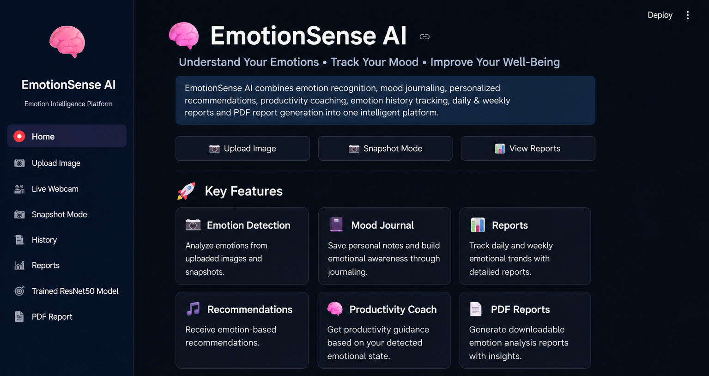
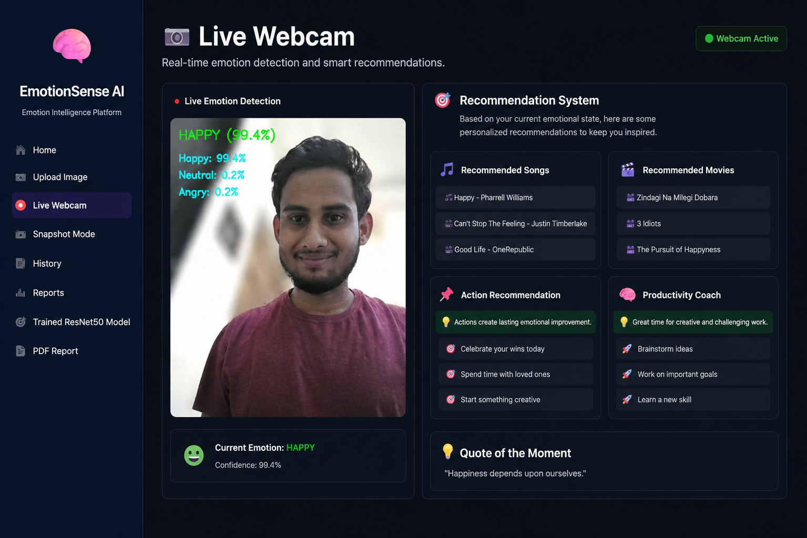
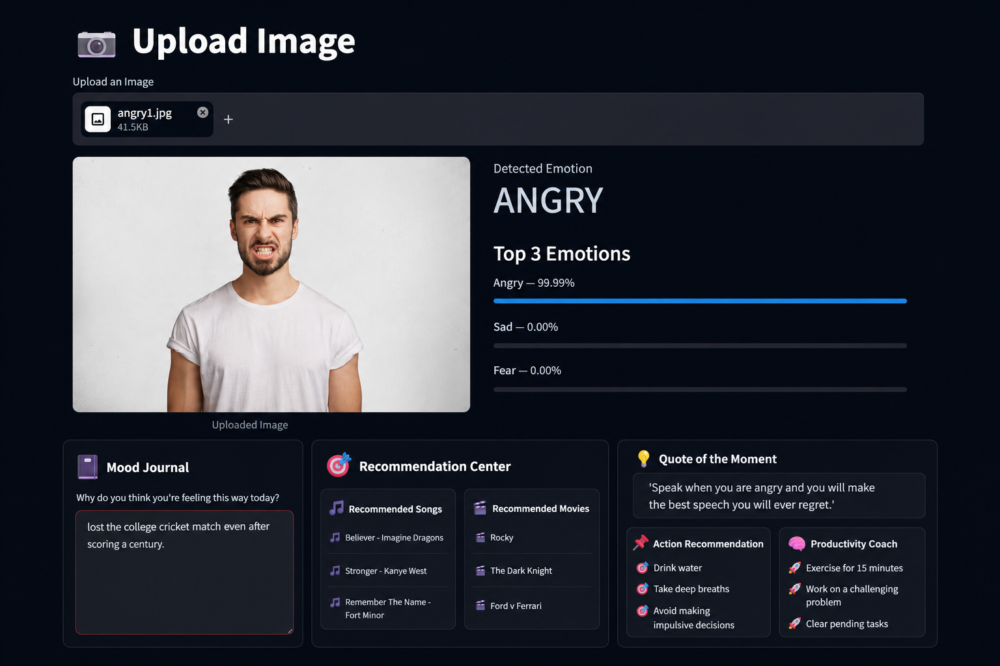
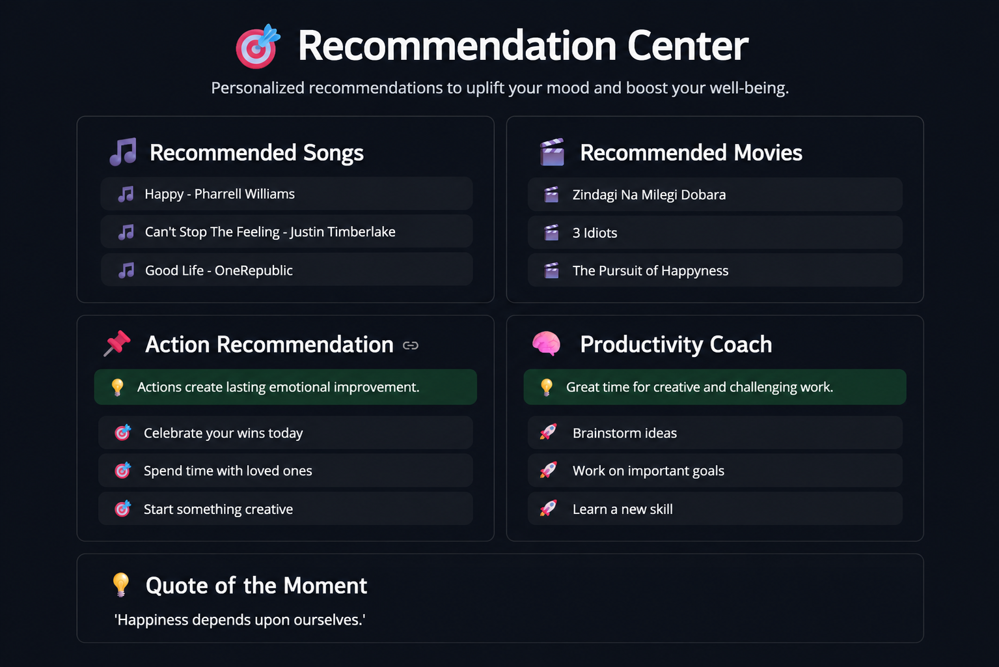
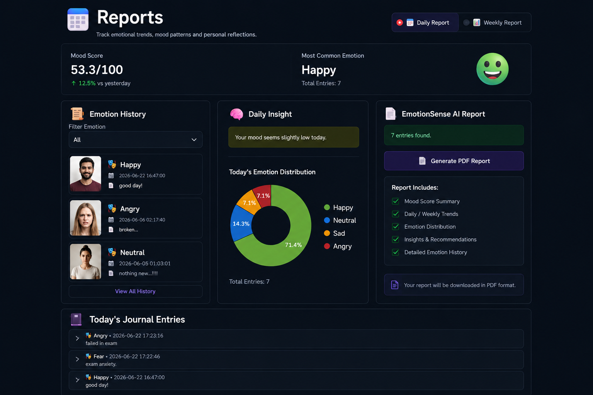
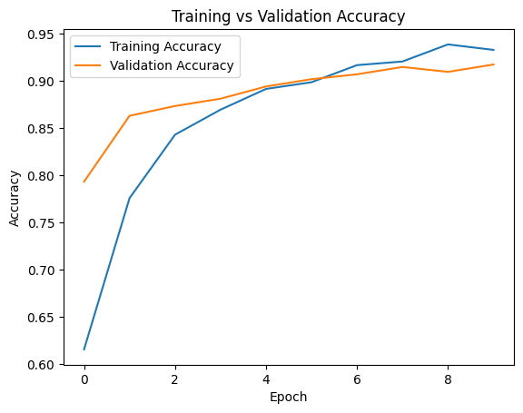
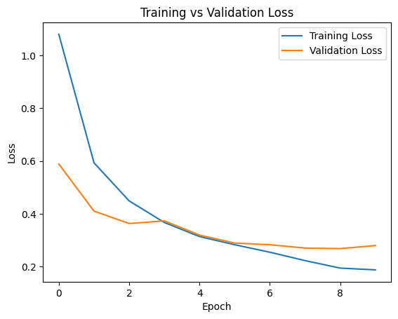
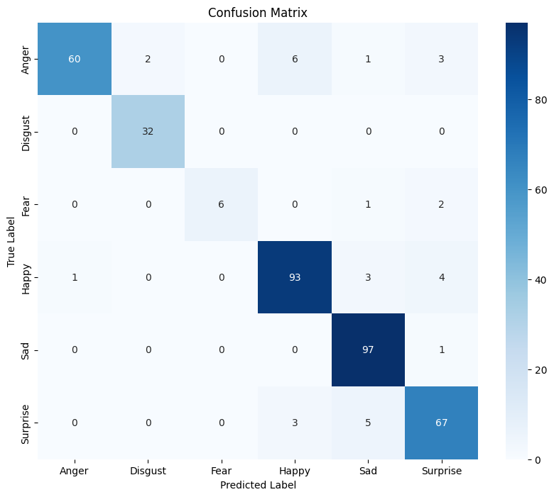

# EmotionSense AI

### AI-Powered Emotion Recognition & Personalized Wellness Platform

EmotionSense AI is an intelligent emotion analytics platform that detects human emotions from facial expressions using a **custom-trained ResNet50 deep learning model (92% validation accuracy)** and provides **personalized song recommendations, movie suggestions, wellness coaching, productivity guidance, and mood analytics** based on the user's emotional state.

---

## Key Highlights

✅ Custom Trained ResNet50 Emotion Recognition Model
✅ Real-Time Webcam Emotion Detection
✅ Image-Based Emotion Analysis
✅ Personalized Songs & Movies Recommendations
✅ AI Wellness Coach & Productivity Guidance
✅ Mood Journaling & Emotion History Tracking
✅ Daily & Weekly Emotion Reports
✅ Professional PDF Report Generation
✅ Deep Learning + Computer Vision Powered

---

#  Home Dashboard

The central dashboard provides a complete overview of the platform and quick access to all emotion analytics features.



---

# Real-Time Emotion Detection

EmotionSense AI analyzes facial expressions through a live webcam feed and predicts emotions in real time with confidence scores.

### Features

* Live emotion detection
* Real-time confidence scores
* Face analysis
* Instant emotion recognition



---

# Image Upload Analysis

Users can upload an image and receive detailed emotion predictions along with confidence scores.

### Features

* Upload image
* Emotion classification
* Top emotion probabilities
* Emotion-based insights



---

# Personalized Recommendation Center

One of the core features of EmotionSense AI.

Based on the detected emotion, the system generates personalized songs, movies, wellness coach, productivity coach and quote of the day.!



---

# Emotion Analytics & Reports

Track emotional patterns over time through comprehensive analytics dashboards.

### Features

* Daily mood reports
* Weekly emotion reports
* Mood score analysis
* Emotion distribution charts
* Journal-based emotional insights



---

# Custom ResNet50 Emotion Recognition Model

The platform is powered by a custom-trained ResNet50 model developed using Transfer Learning on the FER2013 facial emotion dataset.

### Model Configuration

| Parameter           | Value              |
| ------------------- | ------------------ |
| Architecture        | ResNet50           |
| Framework           | TensorFlow / Keras |
| Dataset             | FER2013            |
| Technique           | Transfer Learning  |
| Validation Accuracy | 92%                |
| Emotion Classes     | 6                  |

### Supported Emotions

* 😊 Happy
* 😡 Angry
* 😢 Sad
* 😨 Fear
* 😲 Surprise
* 🤢 Disgust

### Training Accuracy Curve

Shows the improvement in training and validation accuracy across epochs.



### Training Loss Curve

Demonstrates stable convergence and reduction in model loss during training.



### Confusion Matrix

Visualizes class-wise prediction performance and evaluation of the trained model.



### Why ResNet50?

ResNet50 was selected for its deep residual learning architecture, strong feature extraction capability, and proven performance in image classification tasks. Transfer Learning enabled efficient training while achieving high accuracy on emotion recognition.

**Result:** The trained model achieved approximately **92% validation accuracy**, providing reliable emotion classification for real-world use cases.
---

# Technology Stack

### Artificial Intelligence & Machine Learning

* TensorFlow
* Keras
* ResNet50
* DeepFace

### Computer Vision

* OpenCV
* Pillow

### Data Processing

* NumPy
* Pandas

### Visualization & Reporting

* Matplotlib
* ReportLab

### Frontend & Deployment

* Streamlit

---

# Project Structure

```text
EmotionSense-AI/
│
├── app.py
├── webcam_emotion.py
├── requirements.txt
├── assets/
├── screenshots/
├── utils/
├── data/
└── README.md
```

# ⚙️ Installation

```bash
git clone https://github.com/SanskarB18/EmotionSense-AI.git

cd EmotionSense-AI

pip install -r requirements.txt

streamlit run app.py
```

---

# Future Enhancements

* Custom ResNet50 Production Deployment
* Explainable AI Integration
* Advanced Emotion Analytics
* Enhanced Recommendation Engine
* Mobile Application Support
* Multi-User Emotion Tracking

---

# Developer

**Sanskar Bardapure**

EmotionSense AI combines Deep Learning, Computer Vision and Personalized AI Recommendations to transform emotion recognition into meaningful emotional insights and actionable wellness guidance.
